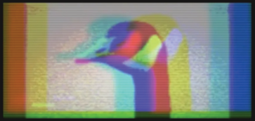

<p align="center">
  
</p>

<h1 align="center">Giga Ranger</h1>
<p align="center"><em>60 km point-to-point SX1280 radio ranging link — British Columbia</em></p>

---

## Overview

Giga Ranger measures the physical distance between two fixed sites using the speed of light. No GPS. Two SX1280 radios exchange round-trip time-of-flight packets; the chip's built-in ranging engine outputs a distance accurate to sub-metre precision over a ~60 km line-of-sight path.

One node sits on a mountaintop. The other is at the valley station. The distance between them changes only as calibration verifies.

---

## Hardware

| Component | Detail |
|---|---|
| MCU + Radio | LILYGO T3-S3 V1.3, SX1280 **without PA** — ESP32-S3 + SX1280 integrated |
| Antenna | 2.4 GHz 13 dBi Yagi, SMA-female, VNA-verified SWR 1.11 @ 2.45 GHz |
| Weather sensor | BME280 (I²C) — feeds atmospheric delay correction |
| Power | RECOM R-78E5.0-1.0 (12 V → 5 V) for field/solar deployment |
| Enclosure | Hammond 1441-12 steel chassis (shielded for calibration) |

**Non-PA version is mandatory.** An external PA breaks the ranging turnaround timing — the SX1280 must control TX/RX switching internally.

### Pin Assignments (T3-S3 V1.3, SX1280)

| Signal | GPIO |
|---|---|
| CS / NSS | 7 |
| SCK | 5 |
| MOSI | 6 |
| MISO | 3 |
| DIO1 | 33 |
| BUSY | 34 |
| RESET | 8 |

---

## Radio Configuration

| Parameter | Value | Reason |
|---|---|---|
| Frequency | 2450 MHz | Centre of 2.4 GHz ISM band |
| Bandwidth | 1625 kHz | Maximum — always use max BW for best ranging precision |
| Spreading Factor | SF9 | Balances precision and link margin |
| TX Power | 13 dBm | Chip maximum |

### Link Budget

| Item | Value |
|---|---|
| TX power | +13 dBm |
| TX antenna gain | +13 dBi |
| RX antenna gain | +13 dBi |
| Free-space path loss @ 2.45 GHz, 60 km | −136 dB |
| Misc losses | −4 dB |
| **Received signal** | **−101 dBm** |
| SX1280 sensitivity (SF9, BW=1625 kHz) | −116 dBm |
| **Link margin** | **~15 dB** |

---

## How It Works

The SX1280 uses a two-packet round-trip time-of-flight exchange:

1. Master sends a ranging request, starts internal hardware timer
2. Slave receives and re-transmits a synchronised response after a hardware-calibrated delay
3. Master stops the timer — round-trip time = 2 × T_propagation
4. Output: distance in metres (0.1803 m per raw count, empirically derived)

Fixed hardware delays (PCB traces, TX/RX switching, front-end group delay) are characterised once via conducted calibration and written to the `RxTxDelay` register. The chip applies the correction automatically thereafter.

### Atmospheric Correction (GRIN Model)

The lower atmosphere slows the signal (~15 m excess path over 60 km). The BME280 at each site feeds live pressure, temperature, and humidity into an ITU-R P.453 refractivity model. Only the *change* from calibration-day conditions is applied — the survey-day atmosphere is already absorbed in the baseline offset.

---

## Firmware

### Calibration Firmware (`firmware_calibration/`)

Arduino C++ / PlatformIO + RadioLib. Runs the conducted bench calibration to derive the `RxTxDelay` register value before field deployment.

**Signal chain:**
```
[T3-S3 Master] ── 40 dB atten ── 1 m RG-316 ── 40 dB atten ── [T3-S3 Slave]
```

```bash
# Flash slave board
pio run -e slave -t upload

# Flash master board, open monitor
pio run -e master -t upload
pio device monitor
```

The master runs 500 ranging exchanges, prints each result, then outputs the `CalibrationValue`. Swap roles and re-run; average the two values to cancel TX/RX path asymmetry.

**Cable:** DigiKey J10302-ND — RG-316 MIL-DTL-17 (Amphenol CIT), VF = 0.695, electrical length = 0.695 m.

### Production Firmware

Planned: Rust / `esp-idf` with Semtech SX1280 C driver via FFI. Owns the ranging loop, GRIN atmospheric correction, BME280 reads, and on-device web interface served over WiFi.

---

## Calibration Procedure

1. Deploy both nodes at a location with precisely known separation **or** use the conducted bench setup (1 m cable + 80 dB attenuation)
2. Collect 500+ ranging results per role orientation (Master→Slave, then Slave→Master)
3. `CalibrationValue = (mean_A + mean_B) / 2 − cable_counts`
4. Write to `RxTxDelay` register in production firmware
5. Confirm with a second known-distance measurement

GPS coordinates are not used as a distance reference — physical measurement only.

---

## Project Status

- [x] Hardware arrived (T3-S3 V1.3 ×2)
- [x] Pin assignments confirmed from V1.3 schematic
- [x] Calibration firmware written
- [ ] Attenuators arrived (Pasternack, on order)
- [ ] Right-angle SMA board connectors (to order)
- [ ] Bench calibration complete
- [ ] Production firmware (Rust)
- [ ] Field deployment
- [ ] Long-baseline calibration run

---

## References

| Document | Description |
|---|---|
| AN1200.29 | Introduction to Ranging with the SX1280 |
| AN1200.50 | SX1280 Ranging Protocol and Result Processing |
| AN1200.89 | Theory and Principle of Advanced Ranging |
| SX1280 Datasheet Rev 3.3 | §14.5 Ranging Engine, Table 14-60 CalibrationValue |
| Wolf et al. (2019) | WPNC2019 — SX1280 ranging benchmark; σ = 0.5 m at BW=1625 kHz |
| StuartsProjects (2019) | 40 km SX1280 field test — source of 0.1803 m/count conversion factor |

PDFs in `Assets/`.
