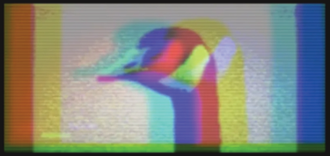

<p align="center">
  
</p>

<h1 align="center">Giga Ranger — Calibration Firmware</h1>
<p align="center"><em>SX1280 ranging calibration for LILYGO T3-S3 V1.3</em></p>

---

## Overview

Ranging calibration corrects for Chimp-001's (slave) internal RX→TX mode-switching delay. This delay varies per chip and cannot be predicted from first principles. Alpha (master) measures round-trip time — Chimp-001 just responds. Because only the slave's correction register affects the ranging result, calibration runs use **Alpha as permanent master** with multiple passes to establish a stable mean. No role reversal is needed.

---

## Flash Instructions

PlatformIO must be installed (`pip install platformio` or via Homebrew).

**1. Flash Chimp-001 (slave)**
```bash
cd firmware_calibration
pio run -e slave -t upload --upload-port /dev/cu.usbmodem<CHIMP001>
```

**2. Flash Alpha (master)**
```bash
pio run -e master -t upload --upload-port /dev/cu.usbmodem<ALPHA>
```

**3. Open serial monitor on Alpha (115200 baud)**
```bash
pio device monitor --port /dev/cu.usbmodem<ALPHA> --baud 115200
```

Press SPACE to start each collection run. The run counter increments automatically — no reset needed between runs.

**Tip — find port:** `ls /dev/cu.*`

---

## Calibration Procedure

Assemble the signal chain before opening the monitor:

```
[Alpha (master)] ── SMA ── [40 dB atten] ── [1 m RG-316] ── SMA ── [Chimp-001 (slave)]
```

> **Note:** One 40 dB attenuator is sufficient at −18 dBm TX (−58 dBm at RX).
> **Warning:** Never exceed +5 dBm — board has a PA FEM that will be damaged.

1. Flash Chimp-001 first, then Alpha
2. Open serial monitor on Alpha; press SPACE when prompted
3. Run 3–5 passes and average the `CalibrationValue` outputs
4. Adjust `CAL_TABLE[2][SF-5]` by the averaged `CalibrationValue`
5. Reflash Alpha with updated table; repeat until `CalibrationValue ≈ 0`

---

## SF9 Calibration Results — Production

**Alpha** is the permanent master. **Chimp-001** is the permanent slave.

Calibration date: 2026-07-04. ESP32 die temp at calibration: 31.3°C.

### Baseline (AN1200.29 default, `CAL_TABLE[2][4]` = 13430)

| Run | Mean | Std Dev | Notes |
|---|---|---|---|
| 1 | −6.877 m | 674 mm | |
| 2 | −6.990 m | 884 mm | |
| 3 | −6.890 m | 882 mm | |
| 4 | −6.947 m | 650 mm | |
| 5 | −6.999 m | 477 mm | corrected: 2 outliers excluded |
| **Avg** | **−6.941 m** | | → applied −166 counts → 13264 |

### Iteration 1 (`CAL_TABLE[2][4]` = 13264)

| Run | Mean | Std Dev | Outliers |
|---|---|---|---|
| 1 | −3.113 m | 452 mm | 1 |
| 2 | −3.308 m | 439 mm | 1 |
| 3 | −3.222 m | 439 mm | 2 |
| 4 | −3.204 m | 448 mm | 1 |
| 5 | −3.298 m | 477 mm | 1 |
| **Avg** | **−3.229 m** | | → applied −175 counts → 13089 |

### Verification (`CAL_TABLE[2][4]` = 13089) ✓

Target = cable electrical length = **0.695 m**

| Run | Mean | Std Dev | CalibrationValue | Outliers |
|---|---|---|---|---|
| 1 | +0.650 m | 476 mm | 0 | 2 |
| 2 | +0.667 m | 467 mm | 0 | 1 |
| 3 | +0.687 m | 473 mm | 0 | 3 |
| **Avg** | **+0.668 m** | **472 mm** | **0** | |

Residual = **−27 mm**. Calibration complete.

### Production calibration table

```cpp
// SF9, BW=1625 kHz — Alpha (master) + Chimp-001 (slave), LILYGO T3-S3 V1.3
// Calibration date: 2026-07-04 · ESP32 die temp: 31.3°C
// AN1200.29 default SF9/BW1625 = 13430; total correction = −341 counts
static const uint16_t CAL_TABLE[3][6] = {
    { 10299, 10271, 10244, 10242, 10230, 10246 },  // BW  406.25 kHz — SF5–SF10
    { 11486, 11474, 11453, 11426, 11417, 11401 },  // BW  812.50 kHz — SF5–SF10
    { 13308, 13493, 13528, 13515, 13089, 13376 },  // BW 1625.00 kHz — SF5–SF10 (SF9 adjusted)
};

// Pass to startRanging() on every exchange — both master and slave builds:
radio.startRanging(master, RANGING_ADDR, CAL_TABLE);
```

---

## Outlier Gate

The calibration firmware rejects ranging samples outside `m < −8.0 || m > +2.0 m`. Rejected samples are printed as `# outlier <value>` in the serial stream and excluded from mean/σ. The RESULTS line reports the count: `500 ok / 0 failed / N outlier`.

SX1280 hardware glitches producing out-of-range single-sample results are a known behaviour. The gate prevents them from biasing the calibration mean.

---

## Cable Constants

| Property | Value |
|---|---|
| Part | DigiKey J10302-ND / 415-0031-M1.0 |
| Type | RG-316 MIL-DTL-17, Amphenol CIT — confirmed from jacket |
| Physical length | 1.000 m |
| Velocity factor | 0.695 |
| Electrical length | 0.695 m |

---

## Pin Assignments (T3-S3 V1.3, SX1280)

| Signal | GPIO |
|---|---|
| CS / NSS | 7 |
| SCK | 5 |
| MOSI | 6 |
| MISO | 3 |
| DIO1 / IRQ | **9** |
| BUSY | **36** |
| RESET | 8 |

---

## Build Environment

| Component | Version |
|---|---|
| PlatformIO | 6.1.19+ |
| RadioLib | 7.7.1 |
| espressif32 platform | 7.0.1 |
| Framework | Arduino |

| Environment | Status | RAM | Flash |
|---|---|---|---|
| master | ✅ SUCCESS | 6.1% | 8.8% |
| slave | ✅ SUCCESS | 6.1% | 8.8% |

---

## Appendix A — Why the Calibration Value Lives on Chimp-001

The SX1280 ranging exchange:

1. Alpha transmits a ranging request
2. Chimp-001 receives it, switches RX→TX, and sends a response after an internal turnaround delay
3. Alpha measures total round-trip time and computes distance

The chip subtracts a fixed assumed turnaround time internally. What it cannot account for is each board's actual RX→TX switching delay, which varies between chips. The `RxTxDelay` register on Chimp-001 adjusts when it transmits its response — shifting Alpha's RTT measurement to compensate.

In RadioLib 7.7.1, `setRangingCalibration()` does not exist. The correction is applied via a custom 3×6 table passed to `startRanging()`. The table is passed by both master and slave builds, but **only Chimp-001's register is active** during ranging (the master's calibration register is unused while it acts as master).

---

## Appendix B — SF10 Calibration (Historical Reference)

SF10 was the initial production candidate before SF9 was confirmed as the better choice for this fixed 60 km LOS link. SF9 gives ~2× better ranging precision (σ ≈ 470 mm vs ~1600 mm) with sufficient link margin.

SF10 calibration was completed 2026-07-03:

| Run | Mean | Std Dev | CalibrationValue |
|---|---|---|---|
| A1 | −7.985 m | 1542 mm | −96 |
| A2 | −8.179 m | 1753 mm | −98 |
| A3 | −8.351 m | 1795 mm | −100 |
| A4 | −8.292 m | 2260 mm | −100 |
| A5 | −8.344 m | 2018 mm | −100 |
| A6 | −8.250 m | 1431 mm | −99 |
| **Final** | **−8.242 m** | | **−99** |

Final verified table value: `CAL_TABLE[2][5]` = **13180** (default 13376 − 196 counts). Verification residual = +53 mm.

---

## Appendix C — AN1200.29 Role-Reversal Method

Semtech AN1200.29 describes averaging calibration runs from both boards acting as master in turn, then averaging the two `CalibrationValue` results. This approach is appropriate when both boards may swap roles in deployment.

For Giga Ranger, Alpha and Chimp-001 have **permanently fixed roles** (labelled). The Chimp Calibration method used here — multiple passes with Alpha as master only — gives a more accurate correction because it measures Chimp-001's actual slave-mode RxTxDelay directly, rather than diluting it into an average with Alpha's delay.
